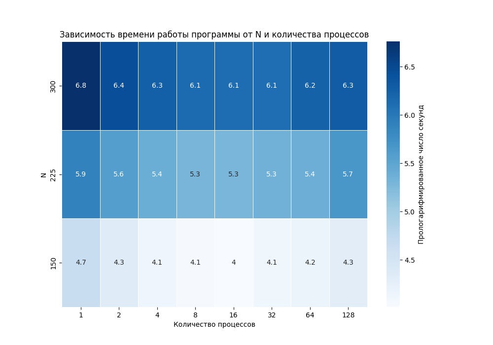

## Parallel programming

Этот репозиторий содержит выполненные семестровые задания по курсам:
- Суперкомпьютеры и параллельная обработка данных (5 семестр ВМК)
- Распределенные системы (7 семестр ВМК)

Подробное описание заданий представлено в отчётах:
- [Алгоритм RedBlack3D на OpenMP и MPI](Отчёт по СКиПОД.pdf)
- [Круговой алгоритм выбора координатора + fault tolerance версия RedBlack3D](Отчёт по Распределённым системам.pdf)

### Красивая картинка



### Пример вывода одной из программ

```bash
$ source ../dockervars.sh
$ mpicc main.c -o main
$ mpirun --oversubscribe -n 5 --with-ft ulfm main

rank 1, from 2 to 3
rank 0, from 1 to 2
rank 2, from 3 to 4
rank 3, from 4 to 5
rank 4, from 5 to 9
killed.
rank 1, from 3 to 5
rank 2, from 5 to 7
rank 3, from 7 to 9
rank 0, from 1 to 3
sum = 18.893315
0.073041, num_workers = 4
```

